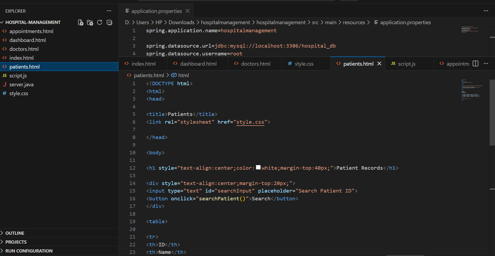

# Medicare - Hospital Management System

##  Description
Medicare is a web-based Hospital Management System designed to manage hospital operations efficiently including patient records, appointments, billing, and doctor management.

##  Features
- Patient Registration & Records
- Appointment Scheduling
- Doctor Management
- Dashboard View

##  Technologies Used
- HTML, CSS, JavaScript
- Java (Backend)
- MySQL (Database)

## 📸 Screenshots

### 🏠 Home Page

### 📊 Dashboard

### 👨‍⚕️ Patients

### 📅 Appointments

### 👨‍⚕️ Doctors

### 💻 Code

##  Author
Pushpitha
